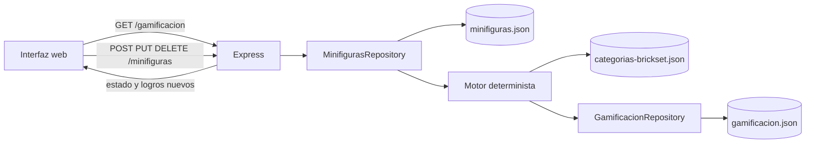

# Diseño: Sistema de gamificación V1

## Contexto

El catálogo actual se persiste en `data/minifiguras.json` mediante `MinifigurasRepository`, que ya encapsula lectura, validación, escritura atómica y las operaciones CRUD. `src/server.js` construye el repositorio y traduce sus errores a respuestas HTTP. La interfaz estática obtiene catálogo, categorías y valoración mediante `fetch`, y sus pruebas de DOM usan JSDOM.

La gamificación debe ser un estado derivado, no una segunda fuente de verdad: el inventario y `data/categorias-brickset.json` son las únicas entradas del cálculo. El estado derivado se conserva para consulta rápida y para comparar la mutación anterior con la nueva y producir feedback de logros.

## Decisiones

### Motor de reglas y niveles

Crear un módulo de dominio separado, por ejemplo `src/gamificacion.js`, con:

- una lista ordenada de niveles `{ id, nombre, umbral }`;
- un catálogo de objetivos `{ id, nombre, bricks, repetible, evaluate }` o reglas equivalentes declarativas;
- una función pura `calcularGamificacion(catalogo, categorias)` que devuelva el desglose, los Bricks totales, el nivel y el progreso;
- una función pura para comparar dos estados y devolver las contribuciones nuevas que deben notificarse.

Las reglas de precio usarán `precio` y, si no es un número finito, `precioCompra` como valor económico disponible. La especificación de gamificación debe fijar esta elección durante la implementación para evitar que el mismo registro se evalúe de manera distinta entre el resumen de valoración y el motor. Las reglas de identificador compararán IDs exactos. Las reglas de categoría y subcategoría usarán los nombres persistidos y los totales positivos definidos en el catálogo oficial.

El resultado del motor debe conservar identificadores estables y datos suficientes para que la interfaz no replique reglas: nombre, Bricks unitarios, cantidad y Bricks acumulados. El cálculo de nivel iterará los umbrales ordenados y determinará el intervalo de progreso; así añadir un nivel futuro solo requiere añadir una entrada de configuración.

### Repositorio y sincronización

Crear `src/gamificacion-repository.js` con una ruta configurable y operaciones de lectura/escritura atómica. El repositorio recibirá dependencias de categorías y podrá:

- inicializar el archivo si no existe leyendo el catálogo actual;
- recalcular y persistir un estado a partir de un catálogo ya leído;
- leer el estado validado;
- devolver el estado anterior y posterior, junto con el delta de objetivos para una mutación.

La integración preferida es inyectar un sincronizador o callback de gamificación en `MinifigurasRepository`. Cada método que persiste el catálogo (`create`, `replace`, `delete`, `updatePrices`) ejecutará el mismo flujo: leer el catálogo anterior, construir y persistir el catálogo siguiente, recalcular desde el catálogo siguiente, persistir `gamificacion.json` y devolver el resultado de gamificación. No se harán incrementos de Bricks en caliente.

Para evitar alterar el contrato de `204` de DELETE, el servidor conservará ese código y la actualización quedará observable mediante `GET /gamificacion`. Las respuestas de POST y PUT podrán añadir un campo `gamificacion` sin eliminar los campos de la minifigura. La sincronización se ejecutará después de una persistencia de catálogo exitosa; los errores del cálculo o del archivo derivado se traducirán a un error interno controlado y se cubrirán con pruebas. La inicialización se hará una vez antes de atender la primera lectura de gamificación o de catálogo, mediante una promesa compartida para evitar carreras entre solicitudes concurrentes.

### API

Añadir `GET /gamificacion`, usando una ruta de archivo configurable desde `createServer({ gamificationPath })`. El servidor deberá inicializar el estado antes de responder y ocultar rutas o detalles de filesystem en los errores.

Mantener los endpoints existentes y sus códigos HTTP. En POST/PUT, incluir el estado o los logros nuevos en una propiedad explícita y estable, por ejemplo `gamificacion: { estado, logrosNuevos }`. El frontend solo consumirá esa propiedad. DELETE y la actualización masiva seguirán devolviendo sus contratos actuales; ambos dispararán el mismo recálculo.

### Persistencia y datos iniciales

Añadir `data/gamificacion.json` como archivo inicial válido. Su contenido debe ser el resultado del motor sobre el inventario existente, no una puntuación escrita a mano. La implementación y las pruebas deben poder usar directorios temporales para catálogo, categorías y gamificación, como ya hacen `test/minifiguras.test.js` y `test/web.test.js`.

La escritura temporal usará el patrón existente de archivo temporal en el mismo directorio y `rename`. Las pruebas verificarán que un fallo al escribir el estado derivado no genera JSON parcial y que un fallo anterior de catálogo no cambia el estado derivado.

### Interfaz

Ampliar `public/index.html` con una zona de estado en la cabecera: botón o enlace con el nivel actual, Bricks, texto del siguiente nivel y una barra nativa (`progress`) con valor y máximo. Añadir un `dialog` para el desglose de logros, con botón accesible de cierre y una lista generada desde la API.

En `public/app.js`:

- cargar `/gamificacion` junto con categorías, catálogo y valoración;
- renderizar el estado y conservarlo actualizado después de POST, PUT, DELETE y sincronización de precios;
- abrir/cerrar el modal sin poner reglas de dominio en el navegador;
- mantener una cola FIFO de Toasts, ordenar cada lote por Bricks ascendentes, insertar cada Toast y esperar 300 ms antes del siguiente;
- conservar los Toasts de error y éxito existentes sin mezclar sus mensajes con los logros.

Los cambios de estilo serán localizados: estado de progreso legible, modal accesible y Toasts apilados sin solapamiento. La interfaz debe degradar mostrando un error visible si `/gamificacion` no está disponible, sin borrar el catálogo ya cargado.

## Flujo de datos

## Compatibilidad y riesgos

- El archivo de gamificación es derivado y puede regenerarse; nunca se editará manualmente para corregir una puntuación.
- La actualización de precio puede cambiar logros de precio y por eso debe usar el mismo hook que el CRUD.
- Los totales de categorías o subcategorías ausentes/cero no deben activar completitud.
- Una escritura en dos archivos no constituye una transacción ACID. La implementación debe minimizar la ventana de inconsistencia, escribir de forma atómica cada archivo y dejar el recálculo repetible para reparar el estado en el siguiente arranque o lectura.
- Las pruebas existentes esperan cuerpos de minifigura y códigos HTTP actuales; cualquier campo adicional debe ser aditivo y no debe romper esas aserciones salvo que se actualicen de manera intencionada.

## Estrategia de pruebas

- Pruebas unitarias del motor para todos los niveles frontera, reglas de precio acumulativas, objetivos especiales, primera presencia, completitud y decrementos por eliminación.
- Pruebas del repositorio para inicialización, escritura atómica, rutas temporales, recalculado tras alta/edición/borrado y actualización de precios.
- Pruebas HTTP para `GET /gamificacion`, inicialización automática, respuestas de mutación y preservación de errores/contratos existentes.
- Pruebas JSDOM para barra, siguiente nivel, modal, desglose, actualización tras una operación y cola de Toasts con orden y temporización de 300 ms.
